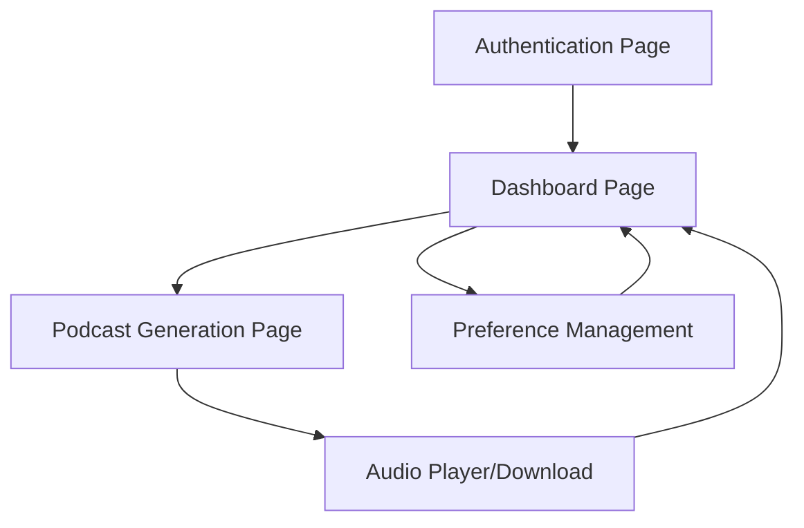

# AI Podcast Generator - Product Requirements Document

## 1. Product Overview

An AI-powered podcast generation platform that automatically creates personalized audio content by fetching the latest industry news, transforming it into natural podcast scripts, and converting them to high-quality audio files.

The platform solves the problem of time-consuming podcast content creation by automating the entire process from news research to audio production, targeting content creators, professionals, and organizations who want to stay updated with industry trends through personalized podcast content.

This hackathon project aims to demonstrate the potential of AI-driven content automation in the podcasting industry.

## 2. Core Features

### 2.1 User Roles

| Role | Registration Method | Core Permissions |
|------|---------------------|------------------|
| Registered User | Email registration via Supabase | Can create personalized podcasts, manage preferences, access generated content |

### 2.2 Feature Module

Our AI podcast generator consists of the following main pages:
1. **Authentication Page**: user registration, login, preference setup
2. **Dashboard Page**: podcast creation interface, user preferences management, podcast history
3. **Podcast Generation Page**: real-time generation status, audio player, download options

### 2.3 Page Details

| Page Name | Module Name | Feature description |
|-----------|-------------|---------------------|
| Authentication Page | User Registration | Register with name, email, and industry preferences (technology, healthcare, etc.) |
| Authentication Page | User Login | Authenticate users through Supabase integration |
| Dashboard Page | Preference Management | Update industry preferences for personalized content |
| Dashboard Page | Podcast History | View previously generated podcasts with playback options |
| Podcast Generation Page | Content Creation | Initiate podcast generation based on user preferences |
| Podcast Generation Page | Real-time Status | Display generation progress (fetching news, creating script, generating audio) |
| Podcast Generation Page | Audio Player | Play generated podcast with standard controls |
| Podcast Generation Page | Download Options | Provide audio file download link and sharing capabilities |

## 3. Core Process

**User Flow:**
1. User registers/logs in with email and sets industry preferences
2. User navigates to podcast generation and initiates creation
3. System fetches latest news based on user preferences using Google Search
4. AI processes news data and generates natural podcast script using Gemini
5. Script is converted to audio using ElevenLabs text-to-speech
6. Audio file is stored and download link is provided to user
7. User can play, download, or share the generated podcast

## 4. User Interface Design

### 4.1 Design Style

- **Primary Colors**: Deep blue (#1e3a8a) and bright green (#10b981)
- **Secondary Colors**: Light gray (#f3f4f6) and dark gray (#374151)
- **Button Style**: Rounded corners with subtle shadows and hover effects
- **Font**: Inter or system fonts, 16px base size for readability
- **Layout Style**: Clean card-based design with top navigation
- **Icons**: Modern outline-style icons, podcast and audio-related emojis (🎧, 🎙️, 📻)

### 4.2 Page Design Overview

| Page Name | Module Name | UI Elements |
|-----------|-------------|-------------|
| Authentication Page | User Registration | Clean form with input fields, primary blue submit button, minimal branding |
| Authentication Page | User Login | Simple login form with email/password, "Remember me" checkbox, green accent |
| Dashboard Page | Preference Management | Dropdown/tag selection for industries, save button with confirmation |
| Dashboard Page | Podcast History | Card-based layout showing podcast thumbnails, titles, dates, play buttons |
| Podcast Generation Page | Content Creation | Large "Generate Podcast" button, preference display, loading animations |
| Podcast Generation Page | Real-time Status | Progress bar with step indicators, status messages, estimated time |
| Podcast Generation Page | Audio Player | Standard audio controls, waveform visualization, duration display |
| Podcast Generation Page | Download Options | Download button, share links, file format options |

### 4.3 Responsiveness

Desktop-first design with mobile-adaptive layout. Touch-optimized controls for mobile devices, with larger buttons and simplified navigation for smaller screens.