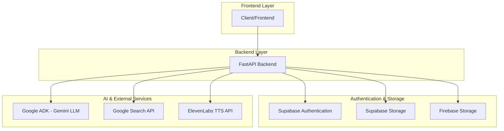
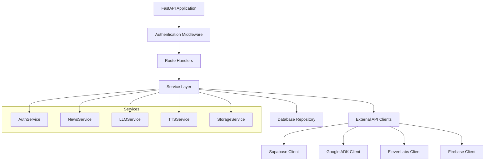
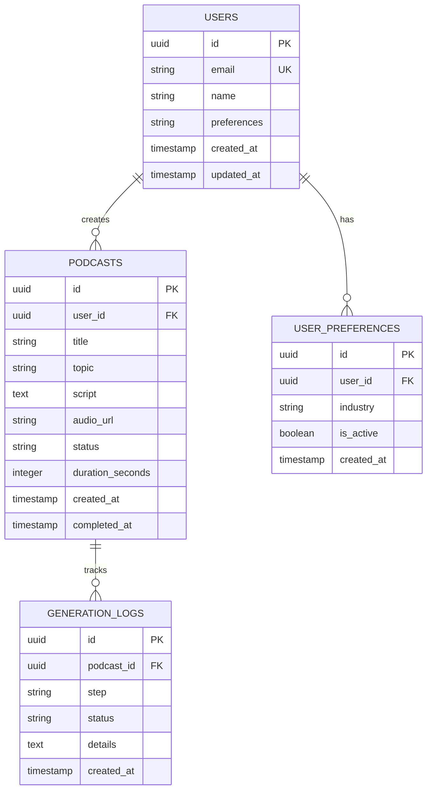

# AI Podcast Generator - Technical Architecture Document

## 1. Architecture Design



## 2. Technology Description

- **Backend**: FastAPI + Python 3.9+ + Uvicorn
- **Authentication**: Supabase Auth
- **Database**: Supabase PostgreSQL
- **Storage**: Supabase Storage (primary), Firebase Storage (fallback)
- **AI Services**: Google ADK (Gemini LLM + Search API)
- **Text-to-Speech**: ElevenLabs API
- **HTTP Client**: httpx for async requests

## 3. Route Definitions

| Route | Purpose |
|-------|---------|
| /auth/signup | User registration with name, email, and preferences |
| /auth/login | User authentication via Supabase |
| /auth/me | Get current user profile and preferences |
| /auth/preferences | Update user industry preferences |
| /podcasts/generate | Main endpoint to generate AI podcast |
| /podcasts/status/{task_id} | Check podcast generation status |
| /podcasts/history | Get user's podcast generation history |
| /podcasts/{podcast_id} | Get specific podcast details and audio link |
| /health | Health check endpoint |

## 4. API Definitions

### 4.1 Core API

**User Authentication**
```
POST /auth/signup
```

Request:
| Param Name | Param Type | isRequired | Description |
|------------|------------|------------|-------------|
| name | string | true | User's full name |
| email | string | true | User's email address |
| password | string | true | User's password |
| preferences | string | true | Industry preference (e.g., "technology", "healthcare") |

Response:
| Param Name | Param Type | Description |
|------------|------------|-------------|
| user | object | User profile information |
| access_token | string | JWT access token |
| refresh_token | string | JWT refresh token |

**Podcast Generation**
```
POST /podcasts/generate
```

Request:
| Param Name | Param Type | isRequired | Description |
|------------|------------|------------|-------------|
| topic | string | false | Specific topic override (uses preferences if not provided) |
| duration | integer | false | Desired podcast duration in minutes (default: 5) |

Response:
| Param Name | Param Type | Description |
|------------|------------|-------------|
| task_id | string | Unique identifier for tracking generation progress |
| status | string | Current status ("initiated", "processing", "completed", "failed") |
| estimated_time | integer | Estimated completion time in seconds |

**Generation Status Check**
```
GET /podcasts/status/{task_id}
```

Response:
| Param Name | Param Type | Description |
|------------|------------|-------------|
| task_id | string | Task identifier |
| status | string | Current status |
| progress | integer | Completion percentage (0-100) |
| current_step | string | Current processing step |
| audio_url | string | Download link (when completed) |
| error_message | string | Error details (if failed) |

Example Response:
```json
{
  "task_id": "uuid-123",
  "status": "processing",
  "progress": 60,
  "current_step": "generating_audio",
  "audio_url": null,
  "error_message": null
}
```

## 5. Server Architecture Diagram



## 6. Data Model

### 6.1 Data Model Definition



### 6.2 Data Definition Language

**Users Table**
```sql
-- Create users table
CREATE TABLE users (
    id UUID PRIMARY KEY DEFAULT gen_random_uuid(),
    email VARCHAR(255) UNIQUE NOT NULL,
    name VARCHAR(100) NOT NULL,
    preferences VARCHAR(100) DEFAULT 'technology',
    created_at TIMESTAMP WITH TIME ZONE DEFAULT NOW(),
    updated_at TIMESTAMP WITH TIME ZONE DEFAULT NOW()
);

-- Create indexes
CREATE INDEX idx_users_email ON users(email);
CREATE INDEX idx_users_preferences ON users(preferences);

-- Grant permissions
GRANT SELECT ON users TO anon;
GRANT ALL PRIVILEGES ON users TO authenticated;
```

**Podcasts Table**
```sql
-- Create podcasts table
CREATE TABLE podcasts (
    id UUID PRIMARY KEY DEFAULT gen_random_uuid(),
    user_id UUID NOT NULL REFERENCES users(id),
    title VARCHAR(255) NOT NULL,
    topic VARCHAR(255),
    script TEXT,
    audio_url TEXT,
    status VARCHAR(50) DEFAULT 'pending' CHECK (status IN ('pending', 'processing', 'completed', 'failed')),
    duration_seconds INTEGER DEFAULT 0,
    created_at TIMESTAMP WITH TIME ZONE DEFAULT NOW(),
    completed_at TIMESTAMP WITH TIME ZONE
);

-- Create indexes
CREATE INDEX idx_podcasts_user_id ON podcasts(user_id);
CREATE INDEX idx_podcasts_status ON podcasts(status);
CREATE INDEX idx_podcasts_created_at ON podcasts(created_at DESC);

-- Grant permissions
GRANT SELECT ON podcasts TO anon;
GRANT ALL PRIVILEGES ON podcasts TO authenticated;
```

**Generation Logs Table**
```sql
-- Create generation_logs table
CREATE TABLE generation_logs (
    id UUID PRIMARY KEY DEFAULT gen_random_uuid(),
    podcast_id UUID NOT NULL REFERENCES podcasts(id),
    step VARCHAR(100) NOT NULL,
    status VARCHAR(50) NOT NULL,
    details TEXT,
    created_at TIMESTAMP WITH TIME ZONE DEFAULT NOW()
);

-- Create indexes
CREATE INDEX idx_generation_logs_podcast_id ON generation_logs(podcast_id);
CREATE INDEX idx_generation_logs_created_at ON generation_logs(created_at DESC);

-- Grant permissions
GRANT SELECT ON generation_logs TO anon;
GRANT ALL PRIVILEGES ON generation_logs TO authenticated;
```

**Initial Data**
```sql
-- Insert sample user preferences categories
INSERT INTO users (email, name, preferences) VALUES 
('demo@example.com', 'Demo User', 'technology');

-- Insert sample podcast for testing
INSERT INTO podcasts (user_id, title, topic, status) 
SELECT id, 'Sample